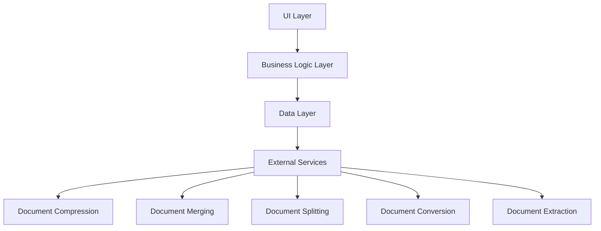

```mermaid
  graph TD;
      A[UI Layer] --> B[Business Logic Layer];
      B --> C[Data Layer];
      C --> D[External Services];
      D --> E[Document Compression];
      D --> F[Document Merging];
      D --> G[Document Splitting];
      D --> H[Document Conversion];
      D --> I[Document Extraction];
```
